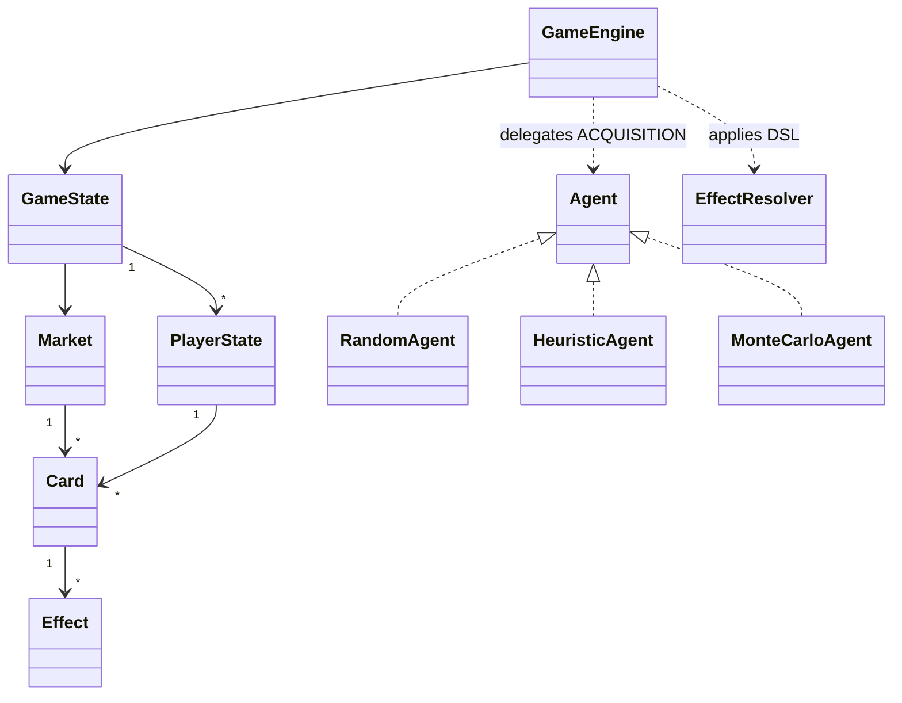

# Developer Guide

## Architecture (MVC + engine)

```
com.whim.b5db
├── model      # immutable data: Card, Effect(DSL), enums (Faction, ContestType, CardType, Phase)
├── engine     # rules: GameEngine (5-phase loop), GameState, PlayerState, Market,
│              #        EffectResolver, Rng, BasicCards, GameResult, Seat, GameConfig
├── ai         # Agent + RandomAgent, HeuristicAgent (EASY/NORMAL/HARD), MonteCarloAgent
├── io         # Json (dependency-free parser/writer), CardLoader, SaveManager, TtsExporter
├── sim        # Simulator, AgentFactory, BalanceReport (CSV/JSON, 20–35% band check)
├── app        # Catalog (load+index cards), Main (CLI: UI / --sim / --export-tts)
└── ui         # MainFrame, GamePanel, MatchController (Swing hotseat)
```

- **Model** is passive/immutable. **Engine** mutates `GameState`. **UI** (`ui`)
  and the **simulator** (`sim`) are two front-ends that drive the *same* engine,
  guaranteeing identical rules in interactive and headless play.
- All randomness flows through `engine.Rng` (a seeded `java.util.Random`), so a
  seed reproduces a whole game or simulation batch — required for the harness.

### Class relationships (simplified)



## The five-phase turn loop (`GameEngine`)

`START` → `STRATEGY` → `ACTION` → `ACQUISITION` → `CLEANUP`

1. **START** — reset INFLUENCE + attribute pools; apply COMMAND_ROW permanents
   (locations grant Influence, agendas grant Prestige, etc.).
2. **STRATEGY** — draw up to hand size (5), reshuffling the discard when needed.
3. **ACTION** — auto-play the hand (adds attributes + runs effects), apply
   same-faction Ally Bonuses, convert DIPLOMACY→INFLUENCE, resolve any beatable
   RIM conflicts (attribute total ≥ difficulty ⇒ +Prestige).
4. **ACQUISITION** — the `Agent` (or human via the UI) spends INFLUENCE on RIM /
   CORRIDOR cards. Permanents enter COMMAND_ROW; others go to the discard.
5. **CLEANUP** — play area + hand → discard; advance seat.

End-game triggers: leader ≥ prestige target **or** RIM deck exhausted **or**
`maxTurns` cap (safety bound for simulations).

## Card-effect DSL

A card is a JSON object; `effects` is an array of verbs interpreted by
`engine.EffectResolver`:

| `type`               | fields              | meaning |
|----------------------|---------------------|---------|
| `GAIN_INFLUENCE`     | `amount`            | +Influence (spend currency) |
| `GAIN_PRESTIGE`      | `amount`            | +Prestige (victory points) |
| `GAIN_ATTRIBUTE`     | `attribute`,`amount`| +pool in DIPLOMACY/INTRIGUE/MILITARY/PSI |
| `DRAW`               | `amount`            | draw cards |
| `TRASH`              | `amount`            | trash weakest hand cards to OUT_OF_GAME |
| `DISCARD_OPPONENT`   | `amount`            | each opponent discards |
| `ADD_AGENDA_PROGRESS`| `amount`            | banks as Prestige in this model |
| `CONVERT_DIPLOMACY`  | —                   | move DIPLOMACY pool 1:1 into Influence |

Card-level fields: `id, name, faction, type, cost, prestige, attributes,
contest, difficulty, effects, text`. `contest`/`difficulty` apply to `CONFLICT`
cards. See `model/Card.java` and `io/CardLoader.java`.

## Extension points

- **New effect verb:** add a constant to `Effect.Type`, a `case` in
  `EffectResolver`, and use it in card JSON. No other code changes.
- **New card / faction flavour:** drop a JSON file in `assets/cards/` (runtime)
  or `src/main/resources/cards/` (bundled; add to `index.txt`).
- **New AI:** implement `ai.Agent` and wire it in `app.Main#makeAgent` and/or the
  `sim.AgentFactory`.
- **Rules tuning:** `engine.GameConfig` (hand size, prestige target, RIM copies,
  max unique cards, max turns).
- **New market structure:** `engine.Market` isolates RIM + CORRIDOR behaviour.

## Design tradeoffs (see also DEVELOPER_SUMMARY.md)

- Card play and conflict participation are **automatic**; the only delegated
  decision is ACQUISITION. This keeps the AI/search space tractable and the sim
  fast, at the cost of not modelling every hand-timing subtlety of the GDD.
- Attribute contests resolve **against a difficulty** (vs board). Head-to-head
  opponent contests and PSI-negation are specified in the GDD and stubbed as an
  extension point rather than fully wired into the auto-resolver.
- `MonteCarloAgent` uses shallow random rollouts with deep `GameState.copy()`;
  it is the strongest AI but the most expensive — prefer `hard` heuristics for
  large batches.
